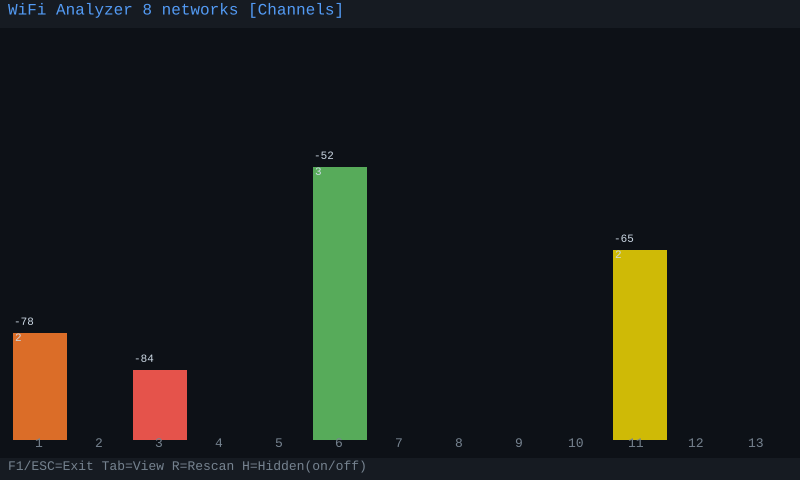
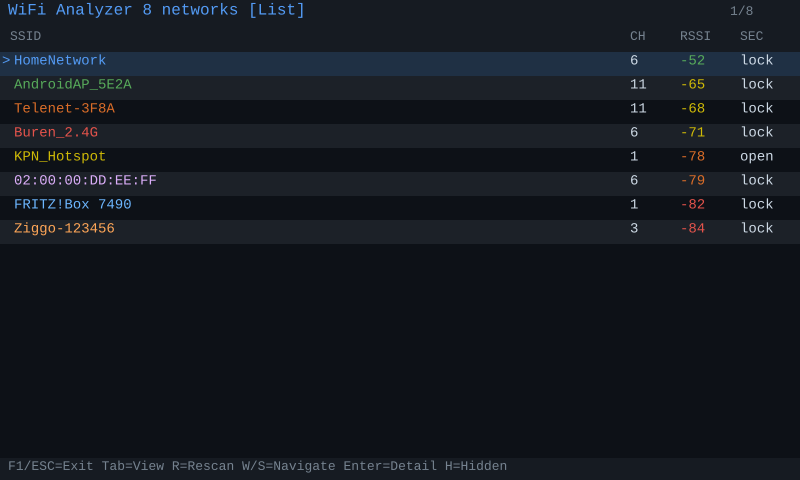
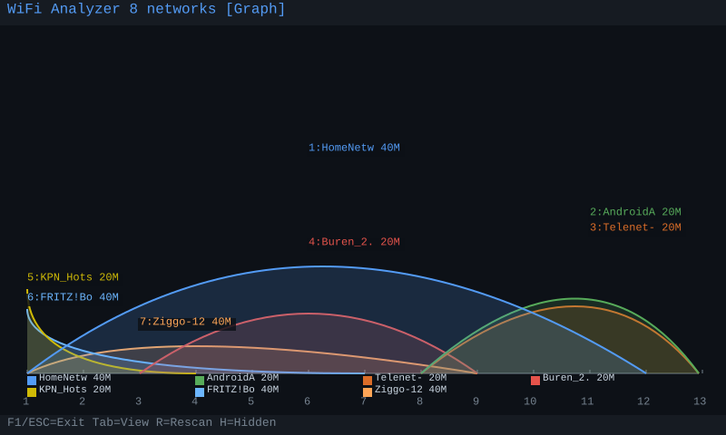
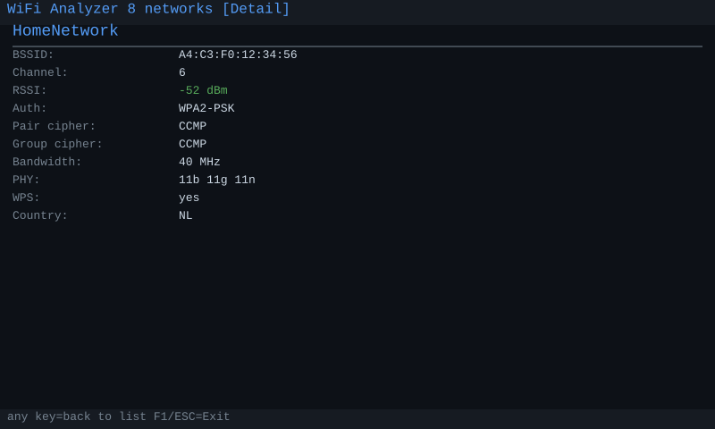

# WiFi Analyzer for Tanmatsu

A 2.4 GHz WiFi channel analyzer app for the **[Tanmatsu](https://tanmatsu.cloud) badge**.

> Scan your surroundings, visualize channel congestion, and monitor signal
> strength per network — directly on the badge display.

---

## Device

| | |
|---|---|
| **Hardware** | Tanmatsu badge (rev 5+) |
| **Application processor** | ESP32-P4 |
| **Radio co-processor** | ESP32-C6 (used for WiFi scanning) |
| **Display** | 4" MIPI DSI, 800×1280 px |
| **Framework** | ESP-IDF v5.5.1 |

The Tanmatsu is an open-source badge developed by
[Nicolai Electronics](https://tanmatsu.cloud).

---

## Views

### Channels
Bar chart showing the combined signal strength per 2.4 GHz channel (1–14).
Useful for quickly spotting congested channels.

### List
Table of all detected networks sorted by signal strength, with:
- SSID (or BSSID for hidden networks), colored per MAC address
- Channel, RSSI (color-coded), Security type

Navigate with W/S or arrow keys and press **Enter** to open the detail screen.

### Detail
Full per-network breakdown: BSSID, channel, RSSI, auth/cipher mode,
bandwidth (20/40/80/160 MHz), PHY standards (11b/g/n/a/ac/ax), WPS, FTM, country.

### Graph
Gaussian arch line curves per AP, bandwidth-scaled and color-coded by MAC address.
A legend strip below the axis shows each AP's color, SSID, and bandwidth.
Hidden SSIDs are hidden by default (toggle with H).

---

## Controls

| Key | Action |
|---|---|
| Tab | Cycle views (Channels → List → Graph) |
| R | Rescan |
| W / S or ↑ / ↓ | Navigate list |
| Enter | Open network detail |
| ESC | Back to list (from detail) |
| H | Toggle hidden SSIDs |
| F1 / Red X | Exit to launcher |

---

## Screenshots

| Channels | List |
|---|---|
|  |  |

| Graph | Detail |
|---|---|
|  |  |

---

## Development write-up

Read about the development journey and lessons learned on Medium:
[Building a WiFi Analyzer on the Tanmatsu Badge](https://medium.com/@cjvansoest/building-a-wifi-analyzer-on-the-tanmatsu-badge-da74dd95209c)

---

## Building

Requires the Tanmatsu ESP-IDF toolchain. Clone the
[Tanmatsu template](https://github.com/Nicolai-Electronics/tanmatsu-template-pax)
first to set up the local toolchain.

```sh
unset IDF_PATH && unset IDF_TOOLS_PATH && make build
```

---

## License

MIT — see [LICENSE](LICENSE).

Developed by **CJ van Soest** with **[Claude AI](https://claude.ai)** (Anthropic)
as AI co-author.

Badge BSP and template by [Nicolai Electronics](https://tanmatsu.cloud) (MIT/CC0).

Feature concept and inspiration credit: **[Saarbastler](https://git.adminforge.de/jjp)**
(tanmatsu-wifi-scanner, MIT) — network list navigation, per-AP detail screen,
and frequency graph with bandwidth-scaled channel visualization.
